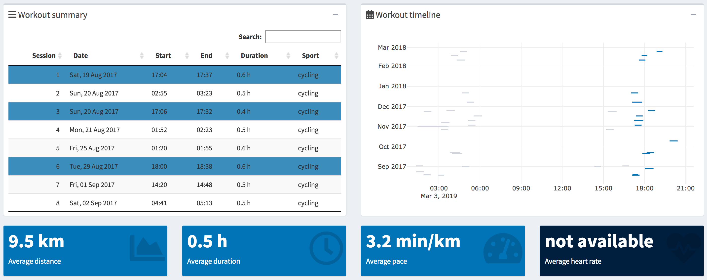
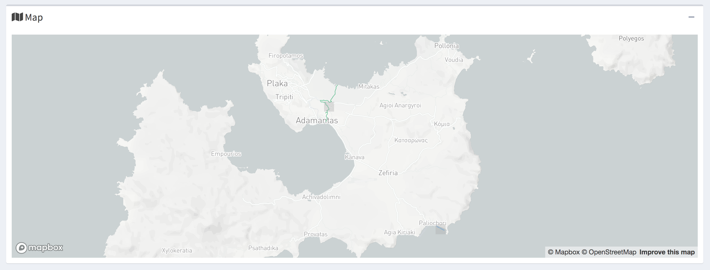
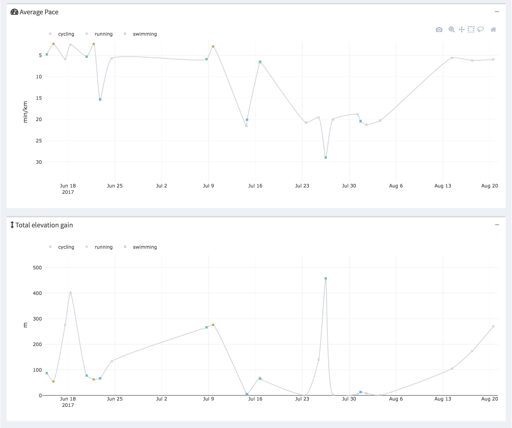
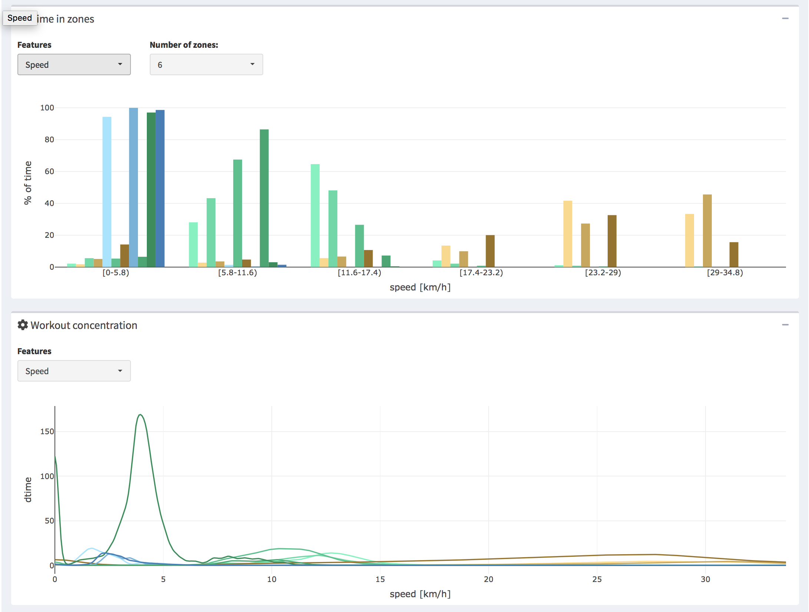

# trackeRapp

The goal of [**trackeRapp**](https://trackerapp.com) is to provide an
integrated workflow and a web interface for the analysis of sports data
from GPS-enabled tracking devices. The **trackeRapp** is a platform with
flexible and extensive visualisation and analytics tools. It has a user
friendly, intuitive and adjustable interface and it was developed as an
open-source interface on top of the
[**trackeR**](https://github.com/trackerproject/trackeR) package. The
interface was fully built using the **shiny** R package.

## Installation

You can install the **trackeRapp** from CRAN by typing

``` r
install.packages("trackeRapp")
```

You can also install the development version of **trackeRapp** from
github by doing

``` r
# install.packages("devtools")
devtools::install_github("trackerproject/trackeRapp")
```

## Getting started

Please see the [**tour de
trackeRapp**](https://trackerproject.github.io/trackeRapp/) to learn
about the **trackeRapp** and all its capabilities, including many
tutorial videos and visualisations. The following are a few screenshots
from the **trackeRapp** web
interface



<br>



<br>



<br>



## Launching the user-interface

A user can access the web interface remotely at
<https://www.trackerapp.com> or on their local machine by running the
following commands:

``` r
# Load the package
library("trackeRapp")
# Open the interface in the browser
trackeR_app()
```
