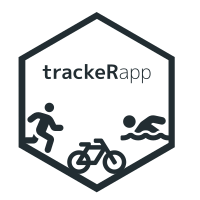

trackeRapp 
================================================================================

[**trackeRapp**](https://trackerapp.com) is a
[**shiny**](http://shiny.rstudio.com) interface for the analysis and
tracking of athletic activity data in R.

**trackeRapp** builds on the extensive infrastructure provided by the
[**trackeR**](https://cran.r-project.org/package=trackeR) R package to
provide a user-friendly web-interface of an integrated workflow for the
analysis of running, cycling and swimming data from GPS-enabled tracking
devices. The interface offers a range of flexible interactive
visualisations and data-analytic tools.

**trackeRapp** offers functionality to import, clean and organise data
from raw activity files of popular formats (tcx, gpx, json and db3) in a
structured R object, and finally to export that object so that it can be
used for future analyses not only within **trackeRapp** but also for
more advanced modelling in R.

Installation
------------

**trackeRapp** can be installed by typing

    install.packages("trackeRapp")

The development version of **trackeRapp** can also be installed directly
from github by doing

    # install.packages("devtools")
    devtools::install_github("trackerproject/trackeRapp")

Getting started
---------------

See the [**tour de
trackeRapp**](https://trackerproject.github.io/trackeRapp/) pages for
tutorial videos, explanation of the workflow and visualizations that
**trackeRapp** offers, and to, generally, learn more about
**trackeRapp** and all of its capabilities.

Below are just a few screenshots from the **trackeRapp** web interface

Session summaries

 

 

 

Video channel
-------------

**trackeRapp** has a dedicated [YouTube
channel](https://www.youtube.com/channel/UCY6y-pw8d1kek1WAIWiVhhw). The
channel features video tutorials about **trackeRapp** and the workflow
it provides.

Launching the user-interface
----------------------------

The web-interface can be accessed remotely at
<https://www.trackerapp.com> or on a local machine by doing:

    # Load the package
    library("trackeRapp")
    # Open the interface in the browser
    trackeR_app()

Code of Conduct
---------------

Please note that this project is released with a [Contributor Code of
Conduct](CONDUCT.md). By participating in this project you agree to
abide by its terms.
