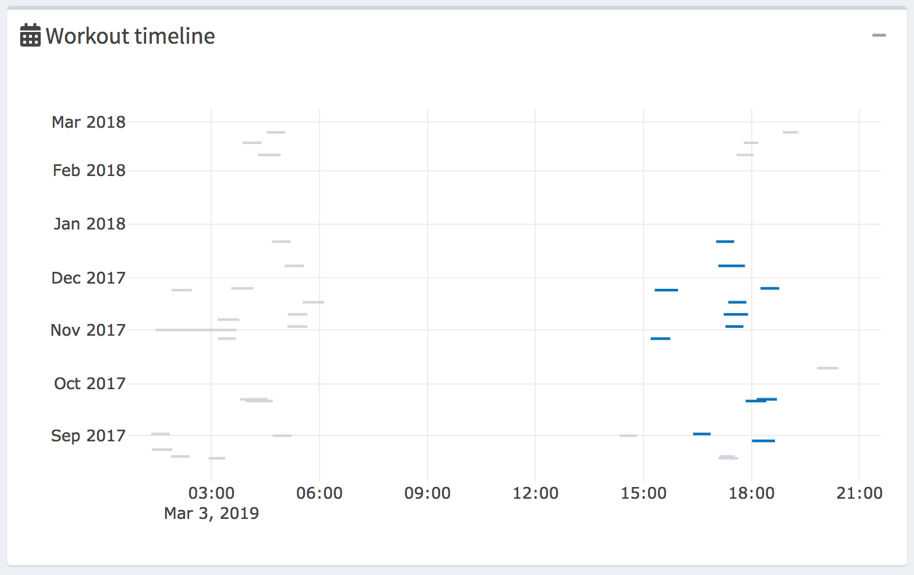
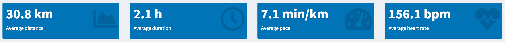
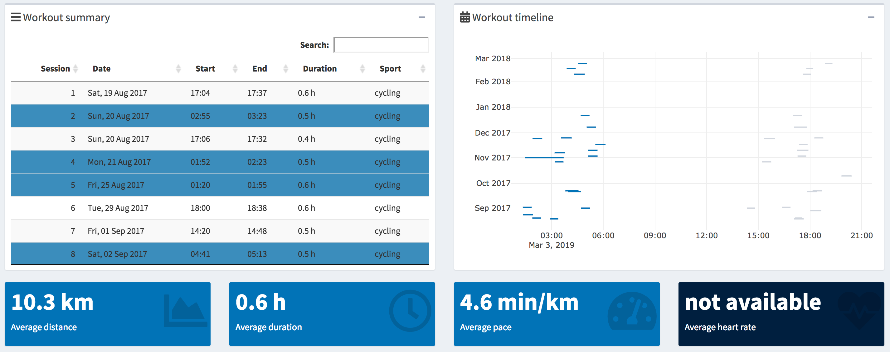
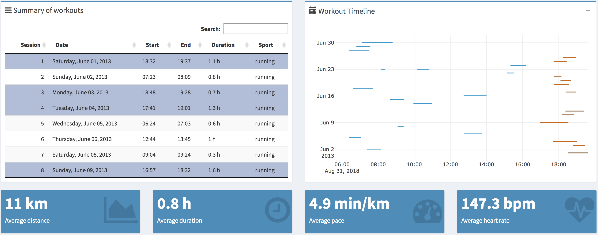
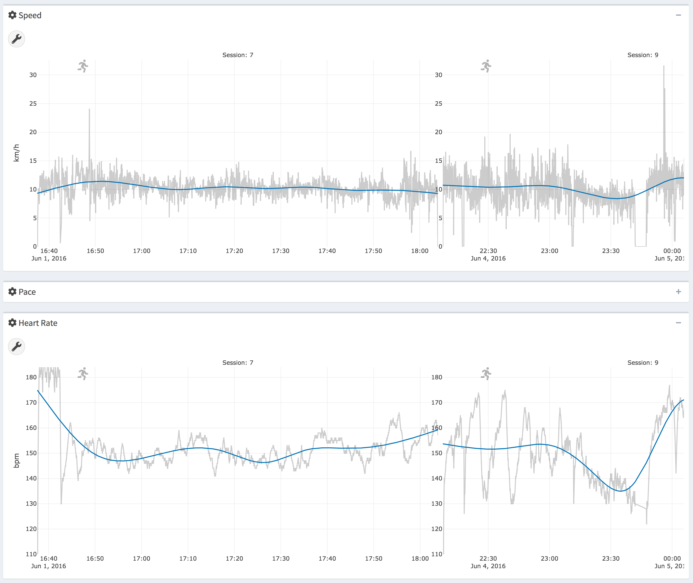
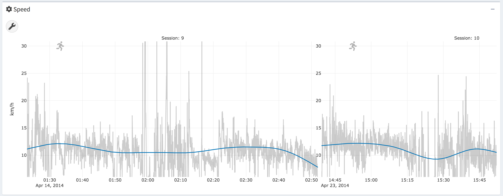

# Interface

```{r global_options, include=FALSE}
knitr::opts_chunk$set(echo = FALSE, warning = FALSE, message = FALSE)
```

In this chapter we introduce the key visualisations, summaries and
analysis that we found to be the most important for an athlete to have a
sufficient and accurate representation of their training both across and
within sessions, as well as to allow an easy comparison and tracking of
their evolution in time.

## Workout timeline 

The workout timeline plot (Figure \@ref(fig:timelinePlot)) shows time, date and length of the
user's sessions. It displays segments of each individual session on a
plot with time of the day on the x-axis and date on the y-axis and the
length of each segment represents the duration of the session. The
workout timeline provides an athlete with valuable information on what
times of the day they tend to train and for how long. The plot exposes
changes in training patterns, such as changes in training times,
frequency and duration.

The ability to select sessions from the timeline plot allows the user to
analyse, for example, evening sessions and morning sessions separately,
as well as the user might be interested in analysing sessions within a
specific time range. For example, Figure \@ref(fig:workoutTimelineSelectedSessions)
illustrates the user selecting
sessions between 14:30-18:00 and 1 - 13 June 2013. As shown in Figure
\@ref(fig:timelinePlot), hovering over session segments displays
the session number, start and end date to provide a more detailed
description.

```{r timelinePlot, out.width='95%', fig.align='center', fig.cap='Workout timeline'}
knitr::include_graphics('Images/timelinePlot.png')
```


```{r workoutTimelineSelectedSessions, out.width='95%', fig.align='center', fig.cap='Workout Timeline - sessions selected by date and time of the day'}

```


## Summary table of selected sessions 

The summary table (Figure \@ref(fig:summarySelectedSessions)) displays the date, the start time, the end time, the duration and the sport of each session. Currently selected sessions are highlighted with a grey colour. In order to accommodate for large datasets, the table is
scrollable with the ability to search for key values.

```{r summarySelectedSessions, out.width='95%', fig.align='center', fig.cap='Summary of Selected Sessions'}
knitr::include_graphics('Images/summary_selected_sessions.png')
```

## Map 

The map (Figure \@ref(fig:map)) displays routes of all the currently selected
sessions in a blue colour and currently selected sessions are highlighted with an orange colour. Hovering over a session displays a basic summary of the session as shown in Figure
\@ref(fig:map). The basic summary displays the session number, 
distance, duration, average pace of the session and also the current speed depending.

```{r map, out.width='95%', fig.align='center', fig.cap='Map'}
knitr::include_graphics('Images/map.png')
```


## Session summaries plots 

The session summary plot in Figure \@ref(fig:sessionSummaries) displays the scalar summaries of each
session on a plot with date on the x-axis and the value on the y-axis.
It also shows the current units of measurement on the y-axis. The plot
enables the user to track their progress over time, identify changes in
their training pattern or detect changes in intensity of their
performance.

Session summary values include: average speed, pace, power, cadence running, cadence cycling, and
heart rate, where each variable is calculated over the time spent moving throughout the session. The summaries also include total distance covered, total duration, and work-to-rest ratio. See @trackeR for detail on calculation of each variable and any mathematical
formulae.

The **trackeRapp** implements plots for all the scalar summaries
and the user is able to select which variables to plot, where each
selected variable is individually plotted in a separate box (Figure
\@ref(fig:sessionSummaries)), providing a clear separation in the
user interface. As shown in Figure
\@ref(fig:sessionSummaries), selected sessions are highlighted
with an orange colour and hovering over an individual point displays the
exact value, the date, the number and the sport of the session.


```{r sessionSummaries, out.width='95%', fig.align='center', fig.cap='Session summary plots for selected variables'}
knitr::include_graphics('Images/session_summaries.png')
```


## Summary boxes of selected sessions 

The summary boxes (Figure \@ref(fig:summaryBoxes)) display the average values for the total
distance covered, average duration, average pace and average heart rate
for the selected sessions (note that all sessions are considered if none
are selected). The boxes provide a tool for an instant analysis and
gaining insights of training data in the selected training sessions.

```{r summaryBoxes, out.width='95%', fig.align='center', fig.cap='Summary boxes'}

```

For example, the user might be interested in comparing their training
results in the morning (6:00-10:00) and the afternoon (17:00-20:00), as
displayed in Figures \@ref(fig:morningSessions) and \@ref(fig:eveningSessions), respectively, by selecting sessions from the
workout timeline plot. The user can right away see that the morning and
afternoon workouts are quite similar in average distance, pace and heart
rate and the afternoon workouts seem to have on average slightly higher
average pace.

```{r morningSessions, out.width='95%', fig.align='center', fig.cap='Morning workouts'}

```

```{r eveningSessions, out.width='95%', fig.align='center', fig.cap='Evening workouts'}

```

## Individual sessions plots 

The plots of individual sessions (Figure \@ref(fig:individualSessionNew)) display the changes of a given
variable over the course of the selected sessions, with x-axis
representing the time and y-axis the value. The following variables can
be displayed in the **trackeRapp**: heart rate, altitude, speed,
cadence, power, pace, work-to-rest ratio.

By plotting individual sessions the user is able to obtain a detailed
insight into the evolution of a given variable throughout the session.
For instance, to gain understanding of fluctuations, consistency or
changes in their performance. Selected sessions are plotted
side-by-side, share a common y-axis and are scrollable on the x-axis,
allowing users to analyse and compare the evolution of a given variable
within and between individual sessions. This allows users to, for
example, identify patterns between sessions such as detecting
consistently high fluctuations in heart rate over the selected sessions.

Each plot has exactly two traces, where the grey colour represents the
processed data from and the blue line is the data after
smoothing. 

```{r individualSessionNew, out.width='95%', fig.align='center', fig.cap='Individual session plots'}

```

## Time in zones plots {#timeInZones}

The time in zones plots \@ref(fig:zonesMultipleSessions) are grouped bar charts coloured
by the session number, where x-axis shows the zone categories (e.g.,
speed zones, heart rate zones) and y-axis represents the percentage of
the session spent in the zone. The plots, for example, allow summarizing
and quantifying training intensity distributions by the
time spent exercising in certain zones. The user can also evaluate their
consistency and changes in their performance by comparing the proportion
of time spent in different zones. The **trackeRapp** implements
time in zones plots for the following variables: heart rate, speed,
pace, altitude, cadence and power. In the **trackeRapp** the user
can specify which variables to plot, as well as how many zones to split
the data into. An exact percentage values are displayed by hovering over
individual bars.

In Figure \@ref(fig:zonesMultipleSessions), 4 sessions and the variables
speed, heart rate and cadence were selected, each split into 6 zones.
The user can see that session 13 had a lot higher intensity than the
other three sessions, with a heart rate of above 155 bpm 95% of the time
and cadence above 92 steps/min around 70% of the session. It appears
that the user's heart rate distribution was changing over the four
sessions, with higher proportion of sessions in the 155-170 bpm zone and
less time being spent in the 140-155 zone. The user can also analyse
intensity by the time spent above critical power (see @trackeR), assuming CP at
4m/s. In sessions 8,9, and 10 the athlete spent around 15-20% of the
sessions above CP and around 40% above CP in session 13.

```{r zonesMultipleSessions, out.width='95%', fig.align='center', fig.cap='Time in zones multiple sessions'}
knitr::include_graphics('Images/zones_multiple_sessions.png')
```


## Concentration profiles plots 

The concentration profiles (Figure \@ref(fig:concentrationProfiles)) are the negative derivative of
the distribution profiles, where distribution profiles describe the time
spent exercising above a threshold for a selected variable (e.g., m/s or
bpm) in a given session, as defined in @concentration_profiles. The
x-axis shows the value of the selected variable and the y-axis
represents the time differential. The **trackeRapp** implements
concentration profiles plots for the following variables: heart rate,
speed, pace, altitude, cadence and power. Similar to time in zones
plots, the user can specify sessions to be displayed using the legend
and hovering over the lines displays the exact x-axis value.

The concentration profiles can be roughly interpreted as a smoothed
version of the time in zones plots. However, the interpretation of the
time in zones plots are affected by the number of zones selected and can
result in a loss of information and wrong understanding. On the other
hand, the concentration profiles are suitable for revealing
concentrations of time spent around certain values of a given variable,
e.g., heart rate or speed. The shape of the concentrations profile
exposes important insights about the user's sessions. The peaks of the
profile reveal the distribution's modes, which are the concentrations of
the most frequent values of the distribution, without being influenced
by outliers or skewness of the distribution. For instance, a
double-peaked distribution might reveal the concentration of the warm-up
and cool-down speeds. The height of the concentration profile provides
information on the exact time spent at different values allowing for a
clear comparison between sessions. The spread of the profile shows how
variable and consistent the values are in the session. For instance, a
relatively narrow (small standard deviation) distribution with a
distinct peak suggests a very consistent session with highly
concentrated values. On the other hand, a relatively wide multimodal (no
distinct peak) distribution suggests a session with high fluctuations in
values.

```{r concentrationProfiles, out.width='95%', fig.align='center', fig.cap='Heart rate comparison between Sessions 14 and 10'}
knitr::include_graphics('Images/concentration_profiles.png')
```

```{r heartRateComparison,out.width='95%', fig.align='center', fig.cap='Heart rate comparison between Sessions 14 and 10'}
knitr::include_graphics('Images/heart_rate_session_comparison.png')
```

The importance of concentration profiles can be demonstrated using the
same example as in Section \@ref(timeInZones) with the 4 selected sessions \@ref(fig:zonesMultipleSessions) and concentration profiles for
the same four sessions (Figure \@ref(fig:concentrationProfiles)). The profiles reveal that in
session 13 the athlete's heart rate is very strongly concentrated near
158-160 bpm, i.e., on the lower range of 155-170bpm range of the time in
zones plot. On the other hand, session 10 is completely different, where
the athlete's heart rate is rather evenly distributed in a wider range
of 140-164 bpm and reaching above 162 bpm relatively more often.
Additionally, the high peak of session 13 reveals that the athletes
heart rate near 158-160 bpm was sustained for a relatively long time
(around 1h 15min). Figure \@ref(fig:heartRateComparison) demonstrates the difference
between sessions 13 and 10 by plotting the individual sessions. Lastly,
assuming critical speed (see Section \@ref(workCapacity)) of 4m/s, the speed of sessions 8, 9 and 10 is
concentrated below the critical speed, whereas session 13 is
concentrated above the critical speed. This might suggest that for an
optimal training progress, the athletes intensity might be too high in
session 13, or too low in the sessions 8, 9 and 10.

<!-- ## Work capacity plot {#workCapacity} -->


<!-- The work capacity plots -->
<!-- (Figure \@ref(fig:sessionExample)) display the amount of a finite work -->
<!-- capacity (W') above a critical power (CP) expended at a given time in -->
<!-- the workout, displayed by the blue line with the grey line representing -->
<!-- the processed data from **trackeR**, where the x-axis represents time -->
<!-- and y-axis the value. -->

<!-- CP is defined as "the maximum rate (of work) that can be kept up for -->
<!-- a very long time without fatigue." [@work_capacity]. CP is, however, -->
<!-- often calculated as the maximum rate (of work) that can be kept for -->
<!-- a particular period of time. For example, the Functional Threshold Power -->
<!-- (FTP) is the CP that can be sustained for one hour . It is assumed that -->
<!-- finite work capacity gets depleted with power output above the CP and -->
<!-- replenished with power output below the CP. Analysis of CP and W' -->
<!-- expended helps athletes evaluate and personalise intensities of their -->
<!-- workouts and maximise progress. For instance, an athlete might aim to -->
<!-- train at \>121% of FTP to increase anaerobic capacity, at 56-75% of FTP -->
<!-- to increase muscle fuel storage (endurance) or at 55% for active -->
<!-- recovery . In order to calculate W' for runners, power and critical -->
<!-- power can be substituted by speed and critical speed, as suggested by -->
<!-- @work_capacity. A detailed explanation with mathematical calculations of -->
<!-- the quantification of work capacity can be found in @trackeR. -->

<!-- Session 10 in Figure \@ref(fig:sessionExample) provides an example (assume CP at 4 -->
<!-- m/s), where the user's speed is well below the 4 m/s CP threshold at the -->
<!-- beginning of the session resulting in almost no W' expended, followed by -->
<!-- an increased speed above the CP threshold for a short segment resulting -->
<!-- in a steep increase in W' expended and a subsequent reduction in speed -->
<!-- below the CP threshold resulting in a gradual replenishment of W' -->
<!-- continuing until the end of the session. -->

<!-- ```{r sessionExample,out.width='95%', fig.align='center', fig.cap='Work capacity'} -->
<!-- knitr::include_graphics('Images/session_example.png') -->
<!-- ``` -->

## Sports identification 

Many athletes collect data on various sports, such as swimming, running
and cycling. In order to allow the user to analyse the individual sports
separately, the **trackeRapp** splits the users sessions by sport. The **trackeRapp** lets the  select which sports to display as shown in Figure \@ref(fig:sportClassification), where the user can select any
subset of the sports and the user interface is automatically updated
based on the selection.

```{r sportClassification,out.width='95%', fig.align='center', fig.cap='Sport classification'}
knitr::include_graphics('Images/sport_classification.png')
```

## Changepoint detection within sessions {#changepointDetection}

In order to provide an athlete with insights on their consistency,
deterioration or improvement of their performance throughout a session
and identify weak or strong segments, the **trackeRapp**
implements a changepoint detection algorithm to detect changes within a
session for the following variables: speed, pace, heart rate, cadence running, cadence cycling and
power (see example in Figure \@ref(fig:changePointDetection)). The changepoints are
detected in a given plot by clicking the *Detect changepoints* button in the toolbox circle in the top left corner of each plot
and the detected segments in each of the selected sessions are displayed
by a dark red dash lines.

The changepoint detection is implemented separately for all of the variables available in the users dataset. The user is able to select the maximum number of
changepoints to search for in a session. This provides the flexibility
to limit the number of segments to only detect, for example, the two
most important changes in the session. For instance, in Figure
\@ref(fig:changePointDetectionTriathlon) the maximum number of
changepoints is set to two changes for heart rate and four changes for
speed. However, the algorithm might detect fewer segments than the
maximum set by the user due to the penalty measure implemented, in order
to avoid over-fitting. By providing the option
to set the maximum number of changepoints, the user is able to set a
reasonable maximum number after observing the shape of the data.


```{r changePointDetection, out.width='95%', fig.align='center', fig.cap='Changepoint detection in two triathlon sessions (dark red dash line'}

```


